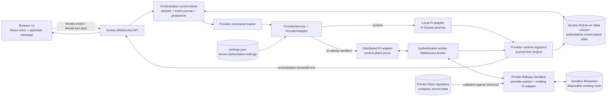

# Browser-to-Pi Message Flow and Storage Map

This document describes the current Synara path from pressing **Send** in the browser to receiving a Pi answer. It covers both the unchanged local path and the additive Railway Sandbox path.

## The boundary in one picture

The browser, orchestration engine, and provider runtime are real seams, but they should not be three services sharing SQLite or S3. The orchestration control plane is the single writer and durable authority. Providers are replaceable execution workers behind `ProviderAdapterShape`. SQLite/Postgres stores control-plane facts; object storage stores immutable large artifacts; neither is a command bus.

## Before the first message: choosing placement

Pi's `providers.pi.executionTarget` setting is changed in the browser through the existing server-settings WebSocket method. The server writes an atomic revisioned envelope to `<Synara state dir>/settings.json`.

- Missing setting decodes to `local`.
- `local` selects the existing in-process Pi adapter.
- `railway-sandbox` selects the additive `RoutedPiAdapter` path.
- Railway credentials, authentication mode, environment ID, region, network isolation, worker-control URL, and provider credential allowlist remain process environment values. They are not returned in the settings view or stored in a thread. The v4 preview uses an environment-scoped Railway project token. The initial v3/dev Gitea canary uses a temporary CLI bearer only until a v3/dev project token can be created through Railway's security-gated settings UI.
- The setting is consulted when a Pi provider session starts. Once started, the thread's actual adapter key and runtime binding are persisted in `provider_session_runtime`.

## Before the first message: selecting a Gitea company project

The browser calls `projects.listGiteaCompanies`. The server—not the browser—uses its Gitea read
credential to enumerate the configured `companies/` directory and validate each `company.json`.
The result contains only non-secret descriptors:

- company ID, display name, and safe slug;
- a compatibility controller workspace root such as `/data/gitea-company-projects/cue-cloud`;
- an immutable repository binding: kind, credential-free HTTPS origin, owner, repository, ref, and
  `companies/<slug>` path.

Selecting a descriptor sends the binding through the existing `project.create` command. Server
admission resolves the descriptor again and canonicalizes title, workspace root, and binding, so a
browser cannot substitute a different repository, ref, or path. The binding is stored in the
`project.created` event and in `projection_projects.repository_binding_json`. It is Project
metadata—not a sandbox lease and not a checkout credential.

The browser creates the project with Pi and the already-ensured
`anthropic/claude-fable-5` model. Thread creation then follows the ordinary path below.

## Send path, step by step

### 1. The browser creates optimistic state

`ChatView` constructs client-side values before the network round trip:

- a `messageId` for the user message;
- a `commandId` for each orchestration command;
- selected `ModelSelection`, runtime mode, interaction mode, dispatch mode, attachments, skills, and mentions;
- an optimistic transcript message in the React store, marked as non-streaming;
- local composer and scroll-follow state.

These values are browser memory only until the commands succeed. Attachment bytes are staged through Synara's existing managed-attachment path before the turn command is dispatched.

### 2. A draft becomes a durable thread

For a new chat, the browser first sends `thread.create`. Its payload includes the stable `threadId`, project/chat container, title, model selection, runtime mode, environment/worktree metadata, working directory, and creation time.

The WebSocket server decodes the command with shared contracts and hands it to the orchestration engine. The decider validates invariants and emits `thread.created`; it does not call Pi directly.

The event store appends the event to `orchestration_events` with:

- global `sequence` and unique `event_id`;
- aggregate kind, stream ID, and stream version;
- event type and timestamp;
- command, causation, and correlation IDs;
- actor, JSON payload, and JSON metadata.

Projection workers apply that event to read models such as `projection_projects` and `projection_threads`. These tables are caches that can be rebuilt from `orchestration_events`.

### 3. The browser requests the turn

The browser sends `thread.turn.start` with the user message and its selection/options. The decider normally appends:

- `thread.session-set` with status `starting` when a provider session is needed;
- `thread.turn-start-requested` containing the durable user message and requested execution parameters.

Projection tables create/update the user transcript row, session state, and turn state. The browser receives resulting `orchestration.domainEvent` pushes and replaces its optimistic assumptions with server-authoritative state.

### 4. Durable command delivery claims the request

`ProviderCommandReactor` is a durable consumer of `orchestration_events`, not a callback directly attached to the browser request.

- `orchestration_consumer_state` stores the provider reactor's high-water cursor.
- `orchestration_event_deliveries` stores per-event delivery state (`inflight`, `retry`, `succeeded`, `dead`, or `uncertain`), lease owner/times, attempts, errors, and completion.

That lets a server restart retry or reconcile provider dispatch without asking the browser to resend blindly.

### 5. Synara ensures a provider session

The reactor resolves the projected thread, model, runtime mode, cwd/worktree, attachments, provider options, and current provider binding. It calls `ProviderService.startSession` only when no reusable session exists, then calls `ProviderService.sendTurn`.

`ProviderService` remains the provider-neutral facade. Pi's registered adapter is `RoutedPiAdapter`, which wraps the unchanged local Pi adapter.

## Local Pi branch

With `executionTarget=local`, `RoutedPiAdapter` delegates the same `ProviderSessionStartInput` and `ProviderSendTurnInput` to the existing Pi adapter in the Synara server process. The adapter owns the live Pi SDK session and translates Pi events into canonical `ProviderRuntimeEvent` values.

No browser, orchestration, projection, approval, or transcript code is different in this branch.

## Railway Sandbox branch

### 6. Provision one fenced worker

With `executionTarget=railway-sandbox`, `ProviderWorkerProvisioner` performs a bounded provisioning transaction:

1. Generate a new lifecycle generation and worker ID.
2. Create or reconnect a Railway Sandbox through `WorkspaceRuntime` / `RailwaySandboxRuntime`, using the configured `PRIVATE` or `ISOLATED` network policy.
3. Reserve the exact `(sandboxId, workerId, lifecycleGeneration)` fence in the broker.
4. Issue a random bootstrap credential; keep only its SHA-256 digest in control-plane memory.
5. Upload the already-built atomic `workerMain.mjs` artifact.
6. Write a mode-`0600` worker config and mode-`0500` executable artifact.
7. For a Gitea-bound project, validate the binding again, install the Gitea token only in the sandbox environment, initialize a sparse Git checkout under `/workspace/repository`, fetch the configured ref, check out `FETCH_HEAD` detached, verify the selected `company.json`, and capture the immutable commit SHA. The checkout command contains only the token environment-variable name.
8. Forward only explicitly allowlisted provider API environment variables. Synara owner, database, and Railway administration credentials are rejected from the forwarding list.
9. Upload the worker config with the verified sandbox company cwd, not the controller compatibility path. Remove `repositoryBinding` before the provider RPC because the existing Pi adapter needs only its cwd.
10. Start Node directly, without shell glue. Use a named durable session when Railway supplies one; otherwise keep the live exec attached to and supervised by the current Synara control-plane process.
11. Wait for the worker to connect outward to `/internal/provider-worker` and prove its full fence. `PRIVATE` sandboxes can use the Railway private domain over the dual-stack proxy. The v3/dev `ISOLATED` sandbox uses the controller's public WSS domain because it has NAT egress but no environment private-network access.

Any failure revokes the credential, retires the broker reservation, stops the exact process handle, and destroys the exact sandbox.

When a persisted binding is recovered after a Synara controller replacement, the provisioner first retires the old fence and attempts graceful process termination. It then treats destruction of the previously bound sandbox as the authoritative single-worker barrier and provisions a new sandbox/generation. This deliberately sacrifices unsnapshotted sandbox workspace state instead of allowing an old worker with a stale credential to keep running alongside its replacement.

### 7. Persist the non-secret runtime binding

After the remote worker accepts `session.start`, Synara upserts `provider_session_runtime` for the thread:

- `provider_name = pi`;
- `adapter_key = pi:railway-sandbox`;
- status, runtime mode, last-seen time, resume cursor, and lifecycle generation;
- `runtime_payload_json.distributedPiRuntime` containing schema version, sandbox ID/status/region, worker ID, generation, opaque process/session handle, supervision mode (`durable` or `attached`), cwd, worker home, and—when applicable—the non-secret repository binding plus checked-out commit SHA.

The bootstrap credential and provider API key are never placed in this row.

### 8. Send a typed worker request

The distributed adapter sends a version-1 `ProviderWorkerRequest`:

- common fence fields: protocol version, sandbox ID, worker ID, lifecycle generation;
- a bounded unique request ID;
- method such as `session.start`, `turn.send`, `turn.interrupt`, `request.respond`, or `session.stop`;
- the existing provider input schema as `params`.

The broker correlates one `ProviderWorkerResponse` to the request. Requests are control messages, not database rows. A disconnected or mismatched worker fails the bounded request; a stale generation cannot take over.

### 9. Reuse the existing Pi adapter inside the sandbox

`provider-worker` composes the same Pi adapter layer used locally. It owns:

- the live Pi SDK session object;
- the sandbox workspace and Pi agent directory;
- in-memory request replay/response state and monotonic event sequence;
- the outbound authenticated WebSocket.

It does not contain orchestration, projections, Synara auth sessions, or database access. The sandbox filesystem is working state, not authoritative history.

### 10. Stream provider output back

The sandbox wraps each canonical `ProviderRuntimeEvent` in `ProviderWorkerEvent` with the fence and a positive monotonic sequence. The broker:

- rejects gaps and stale generations;
- deduplicates already-acknowledged replay;
- idempotently appends the accepted canonical event to `provider_runtime_events` before advancing the worker acknowledgement;
- advances the acknowledged sequence across reconnects only after that durable append;
- passes accepted canonical events into the existing provider runtime path.

Worker heartbeats carry the last acknowledged event sequence. They are transport/liveness objects and are not conversation records.

## Answer path and durable storage

### 11. Journal provider output before projection

The broker has already durably appended a remote event before acknowledging it. `ProviderRuntimeIngestion` performs the same repository append idempotently for one common local/remote path, then consumes every accepted canonical event from `provider_runtime_events`:

- journal sequence and unique event ID;
- thread ID, optional turn ID, and lifecycle generation;
- event type, bounded JSON event, and persistence time.

`provider_runtime_open_turns` tracks unsettled provider turns. `provider_runtime_event_consumers` stores the ingestion cursor. This journal is separate from worker event sequence and separate from orchestration event sequence.

### 12. Convert runtime facts into orchestration facts

Ingestion maps provider events—assistant text deltas, completed messages, tool calls, approvals, errors, usage, and terminal turn state—into normal orchestration events. Those are appended to `orchestration_events` and projected into tables including:

- `projection_thread_messages` for user/assistant transcript rows and streaming state;
- `projection_thread_activities` for tools and status rows;
- `projection_thread_sessions` for provider session and active turn state;
- `projection_turns` for requested/started/completed and checkpoint metadata;
- `projection_pending_approvals` for unresolved and resolved interactions.

The server then pushes the same `orchestration.domainEvent` channel used by local providers. The browser reducer updates the existing React store and transcript. There is no distributed-mode transcript type.

## What exists only in memory

- Browser draft, optimistic message, UI selection, scroll and composer state.
- Live WebSocket/RPC request objects and subscribers.
- Orchestration read models loaded in process and reactor leases while being handled.
- Local or sandbox Pi SDK session objects.
- Broker sockets, pending request promises, bootstrap credential digests, and active worker map.
- Worker response replay cache, event sequence counter, and heartbeat timers.

Loss of these objects must be handled through the journals, persisted provider binding, request fencing, and provider-specific recovery—not by treating memory as authority.

## What is stored where today

| Data | Current authority | Notes |
|---|---|---|
| Projects, threads, messages, turn intent, approvals, lifecycle facts | `orchestration_events` in Synara SQLite | Authoritative append-only domain history; the additive Railway preview stores the database on its `/data` volume |
| Gitea company project selection | `project.created` payload + `projection_projects.repository_binding_json` | Non-secret immutable source binding; catalog credential stays in server environment |
| UI query/read state | `projection_*` SQLite tables | Rebuildable from orchestration events |
| Provider output before projection | `provider_runtime_events` | Durable ingestion journal |
| Provider command retry/uncertainty | `orchestration_event_deliveries` + consumer state | Keeps dispatch durable across process failure |
| Selected adapter and distributed binding | `provider_session_runtime` | Contains identifiers and cursors, never bootstrap/API secrets |
| Pi execution target | atomic `settings.json` | Server-authoritative, revisioned; local is default |
| Attachments and managed local artifacts | Existing Synara managed-attachment storage | Metadata travels in orchestration/provider inputs |
| Live Pi session and workspace | Local process/filesystem or sandbox filesystem | Ephemeral runtime state |
| Checked-out company files | `/workspace/repository/companies/<slug>` inside the bound sandbox | Disposable sparse checkout; commit SHA and binding are persisted, file contents are not control-plane truth |
| Railway sandbox inventory/process | Railway control plane plus the active broker/process connection | Project-token execs supplied durable session names in the successful trials, but recovery does not trust a persisted process handle as a single-worker barrier; it destroys and replaces the bound sandbox |
| Browser session | Secure Synara session cookie + server auth records | Separate from provider-worker authentication |

## Microservice recommendation

The useful seams are:

1. **Browser ↔ Synara control plane:** public HTTPS/WebSocket API, authentication, snapshots, and pushes.
2. **Orchestration ↔ provider adapter:** `ProviderService` / `ProviderAdapterShape`; this is the application seam for local versus remote execution.
3. **Remote adapter ↔ provider worker:** private, authenticated, versioned command/event protocol with generation fencing.
4. **Workspace lifecycle:** provider-neutral `WorkspaceRuntime`; Railway Sandbox is one implementation.

Keep orchestration, event ingestion, projection, and provider-command delivery together until horizontal control-plane scale is required. Splitting them early while sharing a SQLite file creates distributed locking and failure ambiguity without real isolation.

For a durable production topology:

- keep SQLite on the attached Railway volume for one control-plane replica, or move the same repositories to Postgres when multiple replicas/query workloads justify it;
- use S3-compatible storage for immutable workspace snapshots, diffs, untracked-file archives, and generated artifacts;
- add a real queue/stream only if command consumers or control-plane replicas must scale independently;
- never use S3 polling or a shared SQLite file as the worker command transport.

## Deliberate current limitations

- The additive preview's controller state is durable on a Railway volume mounted at `/data`, which constrains the service to one mounted control-plane deployment. The repository layer is still SQLite rather than a horizontally shared database.
- Sandbox disk and Pi session files are not yet exported to object storage. Recovery therefore preserves the Synara thread and journals but replaces the old sandbox and loses its unsnapshotted workspace state.
- The in-memory broker is single-control-plane. Persisted bindings drive restart reconciliation, but the broker itself is not horizontally replicated.
- Project-token execs supplied durable Railway session names during the successful trials, but those handles were not reliable enough across controller replacement to prove that an old worker had stopped. Sandbox destruction is therefore the authoritative recovery barrier.
- Remote model/skill/command/composer discovery currently delegates to local discovery; session lifecycle and turns are the remote canary scope.
- Railway project-token authentication is configured for the preview, but production secret rotation and revocation still need an operating procedure.

These limitations are why the current result is an additive canary, not yet the permanent distributed production mode.
