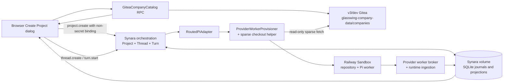

# v3 Gitea Company Projects Design

## Goal

Make the browser-only Synara development deployment usable without local folders. A user selects a company from the `companies/` directory in the v3/dev Gitea repository, creates or opens the corresponding Synara Project, starts a normal chat Thread, and receives a Pi response grounded in that company’s checked-out repository content while the existing distributed orchestration and Railway Sandbox path remains authoritative.

## Verified starting state

- The implementation base is `codex/distributed-runtime-railway`, where browser → orchestration → routed Pi adapter → Railway Sandbox → Pi → durable journals → browser transcript already works.
- Railway project `v3` is `7bf8f727-f0a8-4aea-b1b4-4266aecc49f0`; its `dev` environment is `51f1e0e3-5714-4b56-8214-03e69b0c6afc`.
- v3/dev Gitea is service `glasswing-gitea` (`999981ea-3c2a-4bb2-a077-068673527a7d`) at `https://glasswing-gitea-dev.up.railway.app`.
- The private repository is `glasswing-admin/glasswing-company-data`, branch `main`.
- As inspected on 2026-08-06, `companies/` contains 33 company directories. Each company directory can contain `company.json`, `analysis/`, `inbox/`, and `runs/`.
- `company.json` supplies the stable company slug, display name, company ID, metadata, stage, and other company context.
- The existing browser Create Project dialog only supports local folders and GitHub. Browser folder picking returns `null`, which explains why a browser-only user cannot create the local project required by the new-thread flow.
- v3/dev currently has no Synara service. The existing Glasswing services and all production environments are outside this change’s mutation scope.

## Non-goals

- Do not replace Synara Project, Thread, Turn, provider session, orchestration event, projection, or Railway Sandbox primitives.
- Do not store chat, leases, provider events, or worker commands in Git or Gitea.
- Do not enable Gitea writes from the first version. Company chat is read-only.
- Do not migrate or delete v4 Gitea, v4 Synara, v3/production Gitea, or any production service.
- Do not add Electron behavior. The acceptance path is browser-only.
- Do not make a permanent sandbox per company or per thread.

## Chosen architecture

### Durable hierarchy

The existing hierarchy remains:

```text
Synara Project → Thread → Turn → provider session / sandbox generation
```

A company directory becomes an ordinary Synara Project with one optional repository binding. The binding is project metadata, not a new aggregate.

### Repository binding

Add an optional `repositoryBinding` to Project create events, project projections, shell snapshots, and provider session-start input:

```ts
interface GiteaSubdirectoryBinding {
  kind: "gitea-subdirectory";
  origin: string;
  owner: string;
  repository: string;
  ref: string;
  path: string; // exactly companies/<slug>
}
```

The binding contains no username, token, clone URL with user info, or sandbox credential. The server validates every submitted binding against its configured Gitea catalog before accepting `project.create`; a browser cannot redirect the read token to another origin or repository.

`workspaceRoot` remains a real controller path under the volume, for example `/data/gitea-company-projects/cue-cloud`. This retains compatibility with Synara’s path canonicalization and duplicate-project rules. The controller directory is durable project identity and optional local metadata space; it is not treated as the sandbox checkout.

### Company catalog

Add a server-side `GiteaCompanyCatalog` adapter behind one Native API/WebSocket RPC. It:

1. Loads a server-only configuration containing the Gitea origin, owner, repository, branch, company root, local project root, and read token.
2. Lists directories directly beneath `companies/` through Gitea’s contents API.
3. Reads each `company.json` with bounded concurrency and derives a display name.
4. Returns only non-secret descriptors: slug, display name, workspace root, and repository binding.
5. Caches a successful snapshot briefly to avoid 34 Gitea API requests for every dialog render.
6. Fails visibly when configured but unavailable; it never replaces the catalog with arbitrary local folders.

When catalog configuration is absent, the adapter reports `available: false` and existing Synara deployments retain their current local/GitHub project UI.

### Browser project creation

Extend the existing Create Project dialog with a `company` source rather than adding another screen.

For a browser connected to a configured company catalog:

- Company is the initial and primary source.
- The dialog shows a searchable list of Gitea company names and slugs.
- Local folders are not offered as the browser’s project source.
- Selecting a company and destination Space calls the existing project-create helper with the catalog-supplied title, workspace root, and repository binding.
- The project default model selection is Pi with Pi’s existing default model.
- Duplicate selection recovers and opens the existing Synara Project instead of creating a second project for the same company path.
- The existing flow creates/opens the draft Thread. The first message promotes it with normal `thread.create` and `thread.turn.start` commands.

Electron and non-catalog servers retain Local and GitHub sources unchanged.

### Sandbox checkout preparation

Extend the existing `ProviderWorkerProvisioner` through a focused repository-checkout helper; do not put Git logic in the Pi adapter or worker protocol.

For a Gitea-bound Project routed to `railway-sandbox`:

1. Create a fresh isolated Railway Sandbox with only the existing provider credentials plus the configured Gitea read credential.
2. Validate the project binding exactly matches the server configuration and has a safe `companies/<slug>` path.
3. Initialize a Git checkout at `/workspace/repository`.
4. Authenticate without embedding the token in the persisted binding, logs, or command literal.
5. Configure sparse checkout for the exact company path.
6. Fetch the configured branch with depth one, detach at the fetched commit, and record the non-secret commit SHA in the distributed runtime binding.
7. Start the unchanged provider worker and Pi adapter with cwd `/workspace/repository/companies/<slug>`.

The sandbox checkout, Pi SDK session, Git object cache, and tools are disposable. On controller restart, worker failure, or idle expiry, the existing generation-fenced replacement flow creates a new sandbox and repeats the sparse checkout. Synara’s event journals and thread transcript remain durable on the controller volume.

Gitea-bound Projects fail closed when Pi is routed locally; returning an answer from an empty controller directory would be misleading. Existing local Projects continue to use local Pi exactly as before.

### Network and credential policy

- The v3/dev deployment uses a v3/dev-scoped Railway project token for sandbox administration.
- The Gitea token is the existing v3/dev read-only repository token. It is never exposed to the browser or persisted in Project/provider runtime JSON.
- The first deployment uses Railway Sandbox `ISOLATED` networking and public HTTPS/WSS endpoints for Gitea and the authenticated provider-worker broker. `PRIVATE` remains available for explicitly privileged profiles.
- Extend the current sandbox config with `ISOLATED | PRIVATE`; preserve the previous default for existing deployments.
- The provider-worker bootstrap credential and lifecycle generation continue to fence the public worker-control WebSocket.

## Data flow



## Failure behavior

- Catalog disabled: hide the Company source and preserve existing behavior.
- Catalog request fails: show a retryable error in the dialog; do not show stale local folders as a substitute.
- `company.json` missing or invalid: keep the directory selectable with a humanized slug and safe warning metadata; never fail the entire catalog because one company is malformed.
- Forged/mismatched binding: reject `project.create` before appending an orchestration event.
- Duplicate company: recover the existing Project using the normal workspace-root duplicate path.
- Sparse checkout/auth/ref failure: fail provider session startup with a bounded repository-preparation error, destroy the exact sandbox, and show the normal failed-session state. Never fall back to local Pi.
- Sandbox disappears: use the existing idempotent destroy and replacement-generation path, then repeat checkout.
- Gitea advances after project creation: each new sandbox checks out the then-current configured ref and records the resolved commit used for that execution. A future explicit revision-pin/refresh feature can tighten this without changing Project identity.

## Deployment topology

Create an additive browser-only service named `synara-gitea-dev` in v3/dev:

- its own `/data` volume for SQLite, settings, and auth state;
- its own public HTTPS domain;
- no Electron process;
- one controller replica;
- Pi distributed mode selected in server settings;
- v3/dev Railway Sandbox environment/project token;
- v3/dev Gitea read-only repository configuration;
- Anthropic provider credential already present in v3/dev;
- no changes to `glasswing-web`, `glasswing-api`, workers, Gitea, Postgres, observability services, or any production environment.

## Verification requirements

Completion requires all of the following evidence:

1. Unit/schema tests prove optional historical decoding, binding validation, catalog parsing/cache behavior, and token redaction.
2. Projection/migration tests prove repository binding survives event append, projection rebuild, controller restart, and shell snapshot decoding.
3. UI tests prove browser mode lists company projects, does not require a local folder, creates a bound Project, and opens a Thread.
4. Provisioner tests prove only the configured Gitea binding can receive the credential, checkout happens before worker startup, Pi receives the sparse company cwd, checkout failure destroys the sandbox, and local Pi fails closed for a Gitea Project.
5. Existing local-project and local-Pi tests remain green.
6. A fresh build produces the browser, server, contracts, and provider-worker artifact.
7. In v3/dev browser acceptance, select one real company, create/open its Project, send a question that requires reading repository content, and receive a factually grounded answer.
8. Runtime evidence shows the browser command created a sandbox, sparse checkout resolved a Gitea commit, worker requests completed, provider events were durably accepted, and the transcript survived a controller snapshot/reload.
9. Final inventory proves no production service and no existing Glasswing v3/dev service was changed.

## Deferred work

- Gitea write branches and expected-SHA push semantics.
- LFS hydration beyond what the first read-only company question requires.
- Composer `@file` discovery inside remote checkouts; the provider itself can read the checkout in this version.
- Multi-replica Synara/Postgres migration.
- Repository refresh controls and historical revision selection.
- v4 Gitea migration or deletion.
