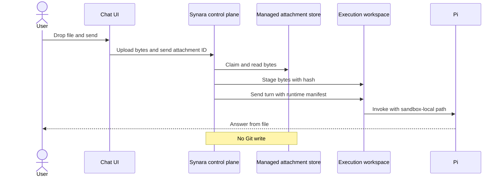
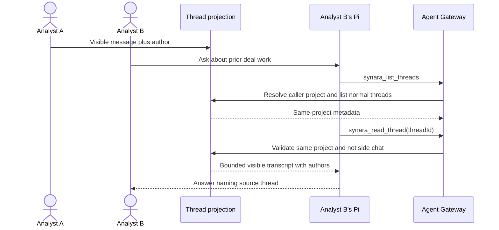
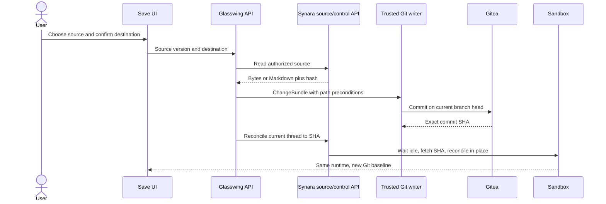
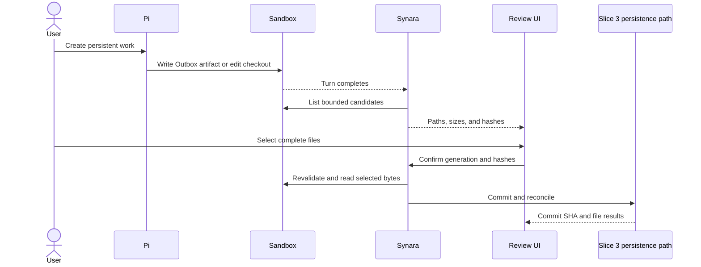

# Glasswing Chat Context and Persistence Design

## Goal

Let Glasswing users discuss transient files with Pi, let Pi read other normal threads in the same company, and explicitly persist selected chat or sandbox material to the company Gitea repository without restarting the current sandbox.

## Boundaries

- A dropped file is transient until the user confirms a save.
- Normal threads are readable within their Synara project; side chats are excluded.
- Gitea is the durable source for selected company material. Synara remains the source for live transcripts and managed attachments.
- Gitea write credentials stay in Glasswing's trusted writer. Sandboxes receive temporary read credentials only while fetching an exact commit.
- Save reconciliation preserves the current sandbox, provider process, and unrelated dirty files.
- All four slices must pass locally before any dev deployment.

## Slice 1: Ephemeral File Chat

The existing composer uploads bytes to Synara's managed attachment store and claims them to the message. Before a remote Pi turn, Synara stages claimed bytes into the bound execution workspace. A worker-only manifest carries the sandbox path, content hash, and size. The worker verifies the manifest and gives Pi the sandbox-local path.

Staging is idempotent for attachment ID plus lifecycle generation. A wrong owner, stale generation, size mismatch, hash mismatch, traversal attempt, or unavailable file stops the turn.

## Slice 2: Company Thread Context

User messages retain the authenticated external subject and display email. Agent Gateway derives the allowed project from the calling thread, filters list results to that project, excludes side chats, and rejects direct reads outside the project.

No new visibility framework or search index is added. Existing title, date, provider, status, and pagination filters remain the discovery surface.

## Slice 3: Persist Chat-Native Material

The UI offers Save on a dropped attachment, assistant response, or complete thread. Confirmation shows the deterministic destination and every included attachment. Glasswing resolves the source through its scoped Synara bridge, constructs a ChangeBundle, and commits through the existing trusted writer.

The writer accepts optional per-path preconditions so a path changed since confirmation returns a conflict. After commit, Glasswing asks Synara to reconcile the current thread to the exact commit. Reconciliation waits for an idle turn, fetches the exact commit with temporary credentials, verifies ancestry, advances the Git baseline, updates only non-conflicting remote paths, and preserves unrelated local state.

Destinations are `inbox/uploads/` for user files, `analysis/notes/` for individual responses, and `analysis/threads/` for whole-thread Markdown. Thread exports contain only visible messages, authors, timestamps, and approved attachment references.

## Slice 4: Persist Sandbox Work

At turn completion Synara lists the current thread's Outbox and Git file changes. The user selects complete files. At confirmation Synara revalidates lifecycle generation, path, type, size, and hash; Glasswing then sends those bytes through the Slice 3 writer and reconciliation path.

The Railway SDK's existing file read, list, and stat operations are exposed through WorkspaceRuntime. Existing Studio output capture is generalized; no sync daemon or candidate database is introduced. Symlinks, traversal, stale generations, oversized content, and paths outside the checkout or Outbox are rejected.

## Local Gate

Each slice gets focused automated tests and a local browser proof. After Slice 4, the complete journey runs against isolated Synara state and ports plus a disposable Git writer fixture. The final pass runs Synara tests, `bun fmt`, `bun lint`, `bun typecheck`, builds the provider worker and embedded package, builds Glasswing, and repeats the browser journey.

## Dev Gate

Immediately before deployment, inspect the live Railway service topology and current remote refs. Deploy additive schemas and receiving APIs before callers. Repeat every local proof against dev, including unchanged Gitea HEAD for transient files, project-scoped thread reads, durable chat and sandbox saves, stable sandbox identity, continued Pi operation, and credential redaction. Production is out of scope.

